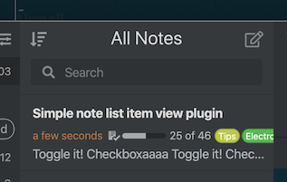
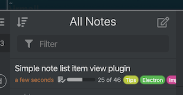

# Simple Note List View Plugin for Inkdrop

This plugin makes note list view thinner.

By default:



With this plugin installed:



## Install

```sh
ipm install simple-note-list
```

Then, reload the app.

## Changelog

See the [GitHub releases](https://github.com/inkdropapp/inkdrop-simple-note-list/releases) for an overview of what changed in each update.

